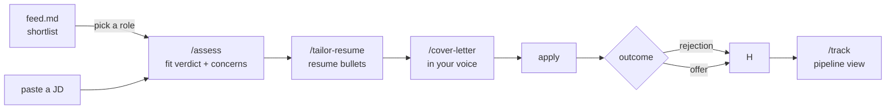

# CareerScout

A Claude Code agent for your job search. Paste your resume once — it finds roles, scores fit, tailors your resume, writes cover letters, and tracks applications.

You don't need to memorise commands. Paste a job description and it runs `/assess`. Paste recruiter feedback and it files it. Mention an outcome ("got rejected", "interview tomorrow") and it logs it and tells you what to do next. Type `/help` any time for a command reference.

---

## How it works

Two loops: the **feed** finds roles worth applying to, the **application loop** helps you apply well.

### Feed loop

```mermaid
flowchart LR
    A["fetch.py<br/>runs daily at 8am"] -->|"scrapes LinkedIn,<br/>Indeed, ATS"| B["today.json<br/>filtered roles"]
    B --> C["/feed<br/>scores each role"]
    C -->|"Recommended /<br/>Stretch / Skipped"| D["feed.md<br/>your shortlist"]
    D --> E{your reaction}
    E -->|felt off| F[/calibrate]
    E -->|worth applying| G[application loop]
    F -->|updates| H[("sources.md<br/>learnings.md<br/>differentiators.md")]
    H -->|read on next run| A
```

| Command | What it does |
|---------|--------------|
| `/feed` | Score today's fetched roles and write the shortlist |
| `/calibrate` | Tune scoring from your feed reactions |
| `/feed reject` | Log a role rejection |
| `/feed add` | Manually add a role to the feed |
| `/retro` | Periodic review — rejection patterns, pipeline health |

> The first few feeds will need calibration. Run `/calibrate` after each early run until the signal feels right — usually 3-5 runs.

### Application loop



| Command | What it does |
|---------|--------------|
| `/improve-resume` | Review and strengthen your master resume _(untested — use with caution)_ |
| `/assess` | Fit verdict, recruiter concerns, and Mnookin fit |
| `/tailor-resume` | Tailor your resume to the JD |
| `/cover-letter` | Write a cover letter in your voice |
| `/notes` | Capture recruiter feedback or call notes |
| `/update` | Log an event — interview, rejection, offer |
| `/track` | View and manage your full pipeline |

---

## Setup

**Prerequisites:** [Claude Code](https://claude.ai/code) installed. Python 3.x only needed for the job feed.

### 1. Clone and open

```bash
git clone <repo>
cd career-coach
```

Open Claude Code in this directory.

### 2. Run `/setup`

Type `/setup` in Claude Code. It walks you through everything in one flow:

- Saves your resume
- Creates your context files from templates
- Calibrates your writing voice (optional)
- Configures the job feed (optional)

Each step can be skipped and done later.

---

## Context files

The agent reads `context/` at session start — you don't re-explain your background each time.

| File | What it is | Auto-updated? |
|------|------------|---------------|
| `resume.md` | Master resume | No |
| `profile.md` | Off-resume context: stories, gaps, comp targets | Yes |
| `bank.md` | Cover letter style, talking points, Q&A | Yes |
| `state.md` | Live application pipeline | Yes |
| `sources.md` | Feed criteria: roles, locations, comp, deal-breakers | Yes — by `/calibrate` |
| `differentiators.md` | Your edges and hard gaps — used in feed scoring | Yes — by `/assess` and `/calibrate` |

---

## Contributing

See `CLAUDE.md` for the full agent instructions and file index.
